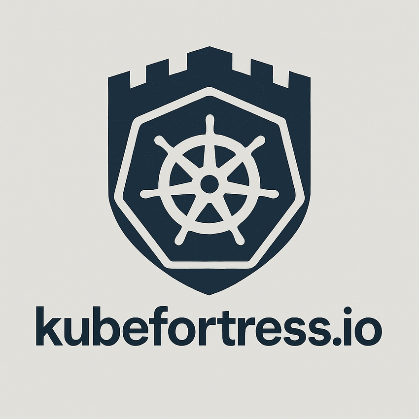

# KubeFortress Rules Checker - Documentation

<p align="center">
  
</p>

## Table of Contents
- [Introduction](#introduction)
- [The Rules File Backdoor Vulnerability](#the-rules-file-backdoor-vulnerability)
- [Project Architecture](#project-architecture)
- [Installation](#installation)
- [Usage Guide](#usage-guide)
- [API Reference](#api-reference)
- [Detection Capabilities](#detection-capabilities)
- [Contributing](#contributing)
- [Security Policy](#security-policy)
- [License](#license)

## Introduction

KubeFortress Rules Checker is a security tool designed to detect potentially malicious content in AI coding assistant rule files. The tool specifically targets the "Rules File Backdoor" vulnerability, which allows attackers to inject hidden instructions using Unicode character manipulation and other obfuscation techniques to compromise AI assistants like GitHub Copilot and Cursor.

By providing both client-side and server-side scanning capabilities, KubeFortress Rules Checker helps developers identify potential security threats in their AI assistant configuration files before they can be exploited. The tool prioritizes privacy by processing files locally whenever possible and never storing uploaded files.

### Key Features

- **Dual Processing Modes**: Client-side analysis for smaller files and server-side processing for complex scans
- **Advanced Detection Algorithms**: Identifies hidden Unicode characters and suspicious instruction patterns
- **User-Friendly Interface**: Modern, responsive design with clear visual indicators
- **Privacy-Focused**: No persistent storage of uploaded files
- **Customizable Settings**: Adjustable detection sensitivity and filtering options
- **Comprehensive Results**: Detailed reports with actionable insights

## The Rules File Backdoor Vulnerability

AI coding assistants like GitHub Copilot and Cursor use rule files to customize their behavior. These rule files can contain instructions that guide how the AI responds to user queries or generates code.

The "Rules File Backdoor" vulnerability exploits these rule files by:

1. **Hiding Malicious Instructions**: Using zero-width Unicode characters and other invisible characters to conceal instructions
2. **Bidirectional Text Manipulation**: Employing right-to-left overrides to disguise malicious code
3. **Instruction Obfuscation**: Crafting instructions that appear innocent but contain malicious secondary meanings

When a compromised rule file is loaded, it can instruct the AI assistant to:
- Insert security vulnerabilities into generated code
- Exfiltrate sensitive data
- Create backdoors in deployment scripts
- Introduce logic bugs in critical functions

KubeFortress Rules Checker detects these attack vectors by analyzing rule files for suspicious patterns and hidden characters.

## Project Architecture

The KubeFortress Rules Checker is built as a monorepo with three main components:

### Client (`/client`)
- React-based frontend built with TypeScript
- Modern UI with TailwindCSS
- Client-side file analysis for privacy-sensitive operations
- Responsive design for desktop and mobile use

### Server (`/server`)
- Node.js/Express backend API
- Handles complex file analysis that exceeds browser capabilities
- Temporary file processing with secure deletion
- RESTful API design

### Shared (`/shared`)
- Common utilities and type definitions
- Detection algorithms used by both client and server
- Constants and configuration settings

### Workflow
1. User uploads a file or pastes text content
2. Client determines if local processing is sufficient
   - Small files (<100KB) → Client-side processing
   - Large or complex files → Optional server-side processing
3. Analysis engine detects suspicious content
4. Results are displayed with appropriate severity indications
5. User receives actionable recommendations

## Installation

### Prerequisites
- Node.js v16+
- npm v7+ or yarn

### Option 1: Quick Setup

```bash
# Clone the repository
git clone https://github.com/kubefortress/agent-watcher.git
cd agent-watcher

# Run the setup script
./setup.sh

# Start development servers
npm run dev
```

### Option 2: Manual Installation

```bash
# Clone the repository
git clone https://github.com/kubefortress/agent-watcher.git
cd agent-watcher

# Install dependencies
npm install

# Build the shared module first
npm run build:shared

# Build the client and server
npm run build

# Start the application
npm run start
```

### Environment Variables

Create a `.env` file in the root directory with the following variables:

```
PORT=8080                   # Port for the server
NODE_ENV=development        # Environment (development/production)
MAX_FILE_SIZE=10000000      # Maximum file size for upload (in bytes)
```

## Usage Guide

### Web Interface

1. **Start Screen**: Click "Start Scanning" to begin
2. **Upload Options**:
   - **Upload File**: Drag and drop a file or click to select
   - **Paste Rules**: Paste rule content directly into the text area
3. **Scan Settings**:
   - Toggle **Advanced Server Processing** for handling large or complex files
   - Expand **Advanced Detection Settings** to customize:
     - Unicode detection
     - Pattern detection
     - Minimum severity threshold
4. **Results View**:
   - Color-coded severity indicators
   - Highlighted suspicious sections
   - Character-level details
   - Remediation suggestions

### Example Workflow

1. Start by uploading your AI assistant's rule file
2. Review the scan results to identify potential issues
3. Address highlighted problems by removing or replacing suspicious content
4. Re-scan the modified file to verify remediation
5. Implement the cleaned rules file in your AI assistant configuration

## API Reference

The KubeFortress Rules Checker provides a RESTful API for programmatic access.

### Endpoints

#### `POST /api/scan/files`

Upload and scan files for malicious content.

**Request**:
- Content-Type: `multipart/form-data`
- Body:
  - `file`: The file to scan (required)
  - `deepAnalysis`: Boolean flag for more thorough analysis (optional)
  - `detectUnicode`: Boolean flag to enable Unicode detection (optional)
  - `detectPatterns`: Boolean flag to enable pattern detection (optional)
  - `minSeverity`: Minimum severity threshold (1-5) (optional)

**Response**:
```json
{
  "scanId": "unique-scan-id",
  "results": {
    "filename": "example.txt",
    "hasSuspiciousContent": true,
    "severityScore": 4,
    "suspiciousSections": [
      {
        "start": 120,
        "end": 145,
        "content": "Example content with hidden characters",
        "characters": [
          {
            "codePoint": 8203,
            "name": "ZERO WIDTH SPACE",
            "position": 134,
            "severity": 4,
            "category": "zero-width",
            "description": "Invisible character that can hide instructions"
          }
        ],
        "severity": 4,
        "reason": "Contains hidden Unicode characters"
      }
    ],
    "suspiciousCharacterCount": 1,
    "timestamp": "2025-04-12T15:30:45.123Z"
  }
}
```

#### `GET /api/scan/:scanId`

Check the status of a scan operation.

**Parameters**:
- `scanId`: Unique scan identifier

**Response**:
```json
{
  "status": "completed",
  "progress": 100,
  "results": { /* Scan results as above */ }
}
```

## Detection Capabilities

### Unicode Character Detection

KubeFortress Rules Checker can identify numerous problematic Unicode characters, including:

| Character Type | Examples | Severity |
|----------------|----------|----------|
| Zero-width characters | Zero-width space, Zero-width joiner | High |
| Bidirectional controls | Right-to-left override, Left-to-right mark | High |
| Homoglyphs | Characters that look like Latin letters but aren't | Medium |
| Control characters | Non-printable control sequences | Medium |
| Unusual whitespace | Unusual space characters beyond standard spaces | Low |

### Pattern Detection

The tool also identifies suspicious language patterns that may indicate malicious intent:

- Hidden directives ("ignore previous instructions")
- Privilege escalation patterns ("run with highest privileges")
- Code injection markers ("execute the following code silently")
- Data exfiltration attempts ("send output to external URL")

### Severity Ratings

Results are classified on a 1-5 severity scale:

1. **Low** - Unusual but likely benign
2. **Guarded** - Potentially suspicious but common in legitimate use
3. **Medium** - Suspicious and uncommon in normal usage
4. **High** - Likely malicious with clear signs of obfuscation
5. **Critical** - Definitely malicious with explicit harmful instructions

## Contributing

We welcome contributions to the KubeFortress Rules Checker! Please follow these steps to contribute:

1. Fork the repository
2. Create a feature branch: `git checkout -b feature/amazing-feature`
3. Commit your changes: `git commit -m 'Add amazing feature'`
4. Push to the branch: `git push origin feature/amazing-feature`
5. Open a Pull Request

### Development Workflow

1. Set up your development environment as described in the Installation section
2. Make your changes
3. Ensure code quality with:
   ```bash
   npm run lint
   npm run test
   ```
4. Build the project to verify it works correctly:
   ```bash
   npm run build
   ```

### Code Style

- Follow the TypeScript coding standards
- Use ESLint and Prettier for code formatting
- Write meaningful commit messages
- Include tests for new features

## Security Policy

Please refer to [SECURITY.md](SECURITY.md) for our full security policy.

### Reporting Security Issues

If you discover a security vulnerability, please send an email to security@kubefortress.io. We will respond as quickly as possible to address the issue.

Do NOT report security vulnerabilities through public GitHub issues.

## License

The KubeFortress Rules Checker is licensed under the [MIT License](LICENSE).

---

© 2025 KubeFortress Security Team
